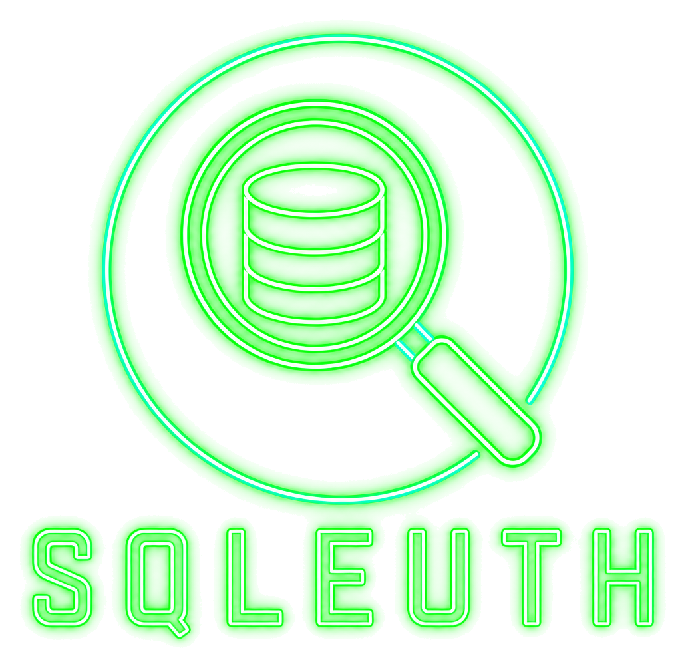

<p align="center">
  
</p>

<h1 align="center">SQLeuth</h1>

<p align="center">
  <strong>A gamified, local-first SQL learning platform styled as a gritty 1940s noir detective game.</strong>
</p>

<p align="center">
  <a href="https://edvardhov.github.io/sqleuth/"><strong>Play the Demo →</strong></a>
</p>

<br />

Solve *The Marlowe File* — a murder mystery at The Blue Dahlia nightclub — by writing SQL queries against a SQLite database of suspects, alibis, phone records, and evidence. An AI narrator (powered by local Ollama) delivers hard-boiled commentary on your findings.


## Demo

**[Play the Demo](https://edvardhov.github.io/sqleuth/)** — runs on GitHub Pages, no backend required.

## Architecture

```
┌─────────────────────────────────────────────────────────┐
│                    Next.js Frontend                      │
│  ┌──────────────────┐    ┌───────────────────────────┐  │
│  │  SQL Terminal    │    │  Evidence Corkboard       │  │
│  │  (CRT phosphor)  │    │  (case files + polaroids) │  │
│  └────────┬─────────┘    └─────────────┬─────────────┘  │
│           │          lib/api.ts         │               │
│           └──────────────┬──────────────┘               │
└──────────────────────────┼──────────────────────────────┘
                           │
              ┌────────────┴────────────┐
              │  Mock JSON (demo mode)  │
              │  FastAPI (live mode)    │
              └────────────┬────────────┘
                           │
         ┌─────────────────┼─────────────────┐
         │                 │                 │
    SQLite (RO)      Ollama /api/generate   /api/solve
```

## Quick Start

### Prerequisites

- Node.js 20+
- Python 3.12+
- [Ollama](https://ollama.com/) with `llama3` pulled (optional — fallbacks exist)

### 1. Clone and configure

```bash
git clone https://github.com/edvardhov/sqleuth.git
cd sqleuth
cp .env.example .env
```

### 2. Backend

```bash
cd backend
pip install -r requirements.txt
python seed.py          # generates data/sqleuth.db
uvicorn app.main:app --reload --port 8000
```

### 3. Frontend

```bash
cd frontend
npm install
npm run dev
```

Open [http://localhost:3000](http://localhost:3000).

### 4. Ollama (optional)

```bash
ollama pull llama3
ollama serve   # runs on http://localhost:11434
```

Without Ollama, narration and text-to-SQL fall back to canned noir responses.

### Docker

```bash
docker compose up --build
```

After code changes, rebuild — `docker compose restart` is not enough:

```bash
docker compose up --build -d
```

Source is volume-mounted for dev hot-reload (`backend/app`, `frontend/src`).

Ollama must run on the host (`host.docker.internal:11434`).

## Gameplay

1. Read the case briefing — Violet Marlowe, found dead at The Blue Dahlia.
2. Write `SELECT` queries in the terminal (Cmd+Enter to run).
3. Results appear as pinned evidence on the corkboard.
4. Use **Ask the Chief** to translate plain English into SQL.
5. Follow hints, cross-reference tables, identify the killer.
6. Click **Accuse** when ready. Correct answer: **Frank Malone**.

### Example queries

```sql
SELECT * FROM crime_scene_reports;
SELECT * FROM phone_records WHERE call_time LIKE '%23:4%';
SELECT s.name, e.item, e.notes
  FROM evidence e
  JOIN suspects s ON s.id = e.suspect_id;
SELECT s.name, i.transcript
  FROM interviews i
  JOIN suspects s ON s.id = i.suspect_id;
```

## API Endpoints

| Method | Path | Description |
|--------|------|-------------|
| POST | `/api/query` | Execute a safe SELECT query |
| POST | `/api/narrate` | Generate noir narration from query results |
| POST | `/api/translate` | Natural language → SQL |
| GET | `/api/schema` | Database schema for case notes |
| GET | `/api/case` | Case briefing and hints |
| POST | `/api/solve` | Submit accusation |

## Demo Mode (GitHub Pages)

The frontend checks `NEXT_PUBLIC_USE_MOCK_DATA`:

- `true` — all API calls route to `lib/mock/` with hardcoded JSON
- `false` — live FastAPI backend at `NEXT_PUBLIC_API_URL`

GitHub Actions builds with mock mode enabled and deploys to Pages.

## Project Structure

```
sqleuth/
├── backend/
│   ├── app/
│   │   ├── main.py           # FastAPI entry
│   │   ├── sql_executor.py   # SELECT-only guard
│   │   ├── ollama_client.py  # AI narration
│   │   └── routers/          # API routes
│   ├── data/
│   │   ├── case.json         # Mystery metadata
│   │   └── sqleuth.db        # Generated by seed.py
│   └── seed.py
├── frontend/
│   ├── src/
│   │   ├── app/              # Next.js pages
│   │   ├── components/       # Terminal, Corkboard, modals
│   │   ├── lib/
│   │   │   ├── api.ts        # API boundary + mock switch
│   │   │   └── mock/         # Demo fixtures
│   │   └── store/            # Zustand game state
│   └── next.config.ts        # Static export config
├── docker-compose.yml
└── .github/workflows/deploy.yml
```

## License

MIT — see [LICENSE](LICENSE).
